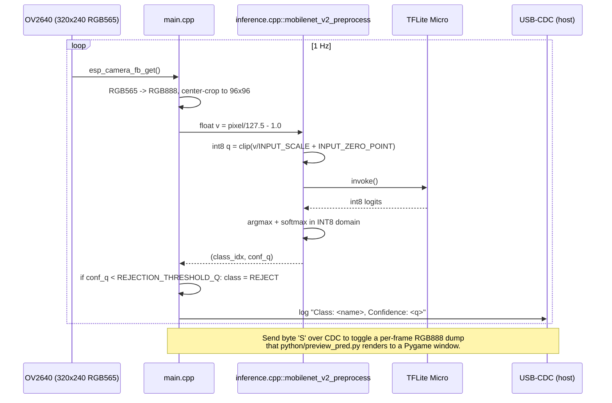

# System architecture

This document describes the end-to-end pipeline: how raw camera frames become
class predictions on the XIAO ESP32-S3 Sense, and how the desktop training
pipeline produces the INT8 model that ships in the firmware. Diagrams are
written in Mermaid so GitHub renders them inline.

## Top-level data flow

```mermaid
flowchart LR
    subgraph collect[1. Data collection]
        A[Self-collected RGB photos<br>3 classes: Amine / Rifki / Jakub]
    end
    subgraph desktop[2. Desktop training pipeline - Python 3.12 / TF 2.21]
        B[augment.py<br>Albumentations 2.0<br>12 variants per original] --> C
        C[preprocess.py<br>MediaPipe Tasks face detect<br>center-crop + resize 96x96<br>normalize -1..1] --> D
        D[main.py / qat_export.py<br>MobileNetV2 alpha=0.35 + dense head<br>QAT INT8 export] --> E
        E[python/gen/model.tflite<br>662 KB INT8] --> F
        F[utils/export_tflite.py<br>writes model.h + model.c] --> G[python/deploy.py<br>copies into esp32/main/]
    end
    subgraph firmware[3. ESP32-S3 firmware - C++ / ESP-IDF 5.x]
        H[OV2640 camera<br>320x240 RGB565] --> I
        I[main.cpp<br>RGB565 -> RGB888<br>center-crop -> 96x96] --> J
        J[inference.cpp<br>mobilenet_v2_preprocess -1..1<br>quantize INT8] --> K
        K[TFLite Micro<br>arena ~1 MB on PSRAM] --> L
        L[Softmax + rejection<br>q >= 0.77 -> log class<br>else log REJECT]
    end
    subgraph eval[4. Evaluation harness]
        M[bench/build_originals_test.py<br>n=60 captures] --> N
        N[bench/eval_branches.py<br>per-sample npz] --> O
        O[bench/compare_models.py<br>paired McNemar] --> P
        P[bench/run_stats.py<br>Wilson CI + cluster bootstrap<br>+ rejection sweep] --> Q[docs/figures + bench/results]
    end

    A --> B
    G --> H
    E -. used by .-> M
```

## Where the artefacts live

| Stage | Inputs | Outputs |
|---|---|---|
| `python/augment.py` | `data/<class>/train/<id>.jpg` | `data/<class>/train/<id>_<aug>.jpg` (12 variants) |
| `python/preprocess.py` | augmented `data/<class>/train` + raw `data/<class>/test` | `python/gen/x_train.npy` / `x_test.npy` / `y_*.npy` |
| `python/main.py` (or `qat_export.py`) | `python/gen/x_*.npy` | `python/gen/model.{tflite,h,c}` + training history |
| `python/deploy.py` | `python/gen/model.{h,c}` | `esp32/main/model.{h,c}` |
| `python/bench/build_originals_test.py` | `data/<class>/test/*.jpg` (originals only) | `python/gen/x_test_originals.npy` etc. |
| `python/bench/compare_models.py` | two `.tflite` files + originals npy | per-sample `.npz` + McNemar markdown |
| `python/bench/run_stats.py` | per-sample `.npz` | `bench/results/stats_summary.md` + JSON |

## ESP32-S3 firmware loop

`esp32/main/main.cpp` holds the application loop; `esp32/main/inference.cpp`
owns the TFLite Micro interpreter and INT8 quantization step. Together they
implement:

## Memory layout on the XIAO ESP32-S3 Sense

- **Flash 8 MB**: OTA-disabled single-app-large partition (`sdkconfig.defaults`)
  holds firmware + the `model_binary` C array (~662 KB).
- **Internal SRAM 512 KB**: stack + scratch buffers + `tflu::MicroAllocator`
  metadata.
- **PSRAM 8 MB Octal**: TFLite Micro tensor arena (~1 MB), camera frame
  buffer (~150 KB for 320x240 RGB565), preview buffer (~230 KB for 320x240
  RGB888 when streaming is enabled).

The choice of `alpha=0.35` and `IMG_SIZE=96` is driven by these constraints:
larger inputs blow the arena past available PSRAM headroom once the camera
double-buffer and the USB-CDC streaming buffer are factored in. See
`docs/report/outline.md` (§Design and implementation) for the trade-off
analysis and `bench/results/mac_count.csv` for the corresponding compute
budget (~10.7 M MACs).
