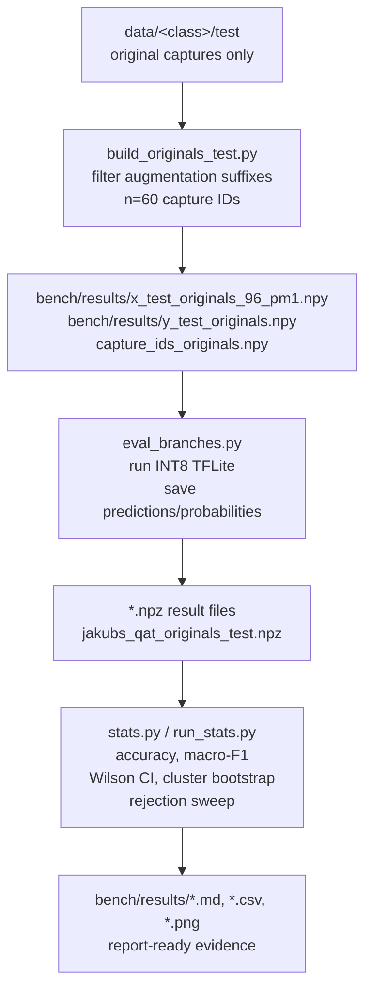

# Architecture

This document summarizes the data, training, deployment, and evaluation flow for the DTU 02214 XIAO ESP32-S3 Sense face-recognition project. Diagrams are written in Mermaid so GitHub can render them directly.

## Training and deployment pipeline

```mermaid
flowchart LR
    A["data/&lt;class&gt;/{train,test}<br/>Amine / Rifki / Jakub<br/>private, gitignored"]
    B["preprocess.py<br/>MediaPipe face crop<br/>96x96 RGB<br/>MobileNetV2 [-1,1]"]
    C["augment.py<br/>Albumentations<br/>8 single + 4 combined<br/>train-time robustness"]
    D["main.py<br/>MobileNetV2 alpha=0.35<br/>transfer learning + QAT<br/>dense=32"]
    E["qat_export.py<br/>PTQ INT8 conversion<br/>representative_dataset<br/>full-integer TFLite"]
    F["python/gen/model.tflite<br/>662 KB<br/>~10.7M MACs"]
    G["deploy.py / export_tflite.py<br/>xxd-style C array"]
    H["esp32/main/{model.h, model.c}<br/>compiled into ESP-IDF app"]
    I["inference.cpp<br/>RGB565 camera frame<br/>crop/resize -> [-1,1]<br/>quantize INT8"]
    J["classification<br/>reject if confidence &lt; 0.9<br/>ESP_LOGI output"]

    A --> B --> C --> D --> E --> F --> G --> H --> I --> J
```

> Implementation note: the current scripts apply `augment.py` to image files before rebuilding the `preprocess.py` NumPy caches. The diagram shows the logical transformations that must remain aligned: raw captures, face-crop/resize/normalization, train-time augmentation, model training, INT8 export, and firmware inference.

### Data layout

Images live under `data/<class>/{train,test}` with class folders `Amine`, `Rifki`, and `Jakub`. The `data/` directory is ignored because it contains identifiable face photos. The report distinguishes original captures from augmented derivatives so the test unit is a capture, not a generated file.

### Preprocessing

`python/preprocess.py` detects faces using MediaPipe, crops with padding, resizes to `96x96` RGB, and maps pixel values from `[0,255]` to `[-1,1]`. That range is the MobileNetV2 convention and must match firmware preprocessing exactly. The F3 regression evidence is published in [`bench/results/firmware_preprocess_check.md`](../bench/results/firmware_preprocess_check.md).

### Augmentation

`python/augment.py` uses Albumentations to create eight single-transform variants and four combined variants. The purpose is robustness to flips, small rotations, affine shifts, brightness/contrast changes, blur, compression, occlusion, and grayscale effects. Evaluation treats augmented test files as correlated diagnostics, not independent test samples.

### Training

`python/main.py` and `python/qat_export.py` implement the selected MobileNetV2 configuration: `alpha=0.35`, `IMG_SIZE=96`, dense head `32`, dropout, label smoothing, and QAT. This is the smallest-alpha configuration within one percentage point of the best tuner trial and is documented in [`bench/results/tuner_summary.md`](../bench/results/tuner_summary.md).

### Quantization and export

`python/qat_export.py` converts the QAT model to full INT8 TFLite using a representative dataset drawn from the training split. `python/utils/export_tflite.py` writes xxd-style C arrays (`model.c` and `model.h`) for ESP-IDF. The resulting `python/gen/model.tflite` is 662,056 bytes and has 10,695,184 estimated compute MACs according to [`bench/results/mac_count.csv`](../bench/results/mac_count.csv).

### Firmware inference

The ESP-IDF application captures RGB565 frames from the XIAO ESP32-S3 Sense camera path, converts to RGB, crops/resizes to `96x96`, applies the same `[-1,1]` MobileNetV2 preprocessing, quantizes to INT8, invokes TFLite Micro, and logs either the predicted class or a rejection through `ESP_LOGI`. The default rejection threshold is `0.9`.

## Evaluation harness flow

### Originals-only test set

The honest test set uses 60 independent captures: 20 originals per class. This fixes finding F1, where augmented derivatives in the test folder made the file-level test appear to have 780 samples. The headline result is therefore 98.33% accuracy and 0.9833 macro-F1 on `n=60`, as reported in [`bench/results/calibration_report.md`](../bench/results/calibration_report.md).

### Statistical summaries

The evaluation scripts save per-sample predictions and probabilities so later statistics can be recomputed without rerunning training. [`bench/results/stats_summary.md`](../bench/results/stats_summary.md) contains Wilson confidence intervals, cluster bootstrap intervals, and rejection-threshold analysis. Pairwise comparisons use exact McNemar tests when more than one candidate model is available.

### Firmware regression check

`python/bench/firmware_preprocess_check.py` is an offline regression test for the firmware preprocessing contract. It compares the old buggy `[0,1]` formula with the fixed `[-1,1]` MobileNetV2 formula using the quantization parameters from the TFLite model. The expected fixed distribution is centered near zero and uses both positive and negative halves of int8.
